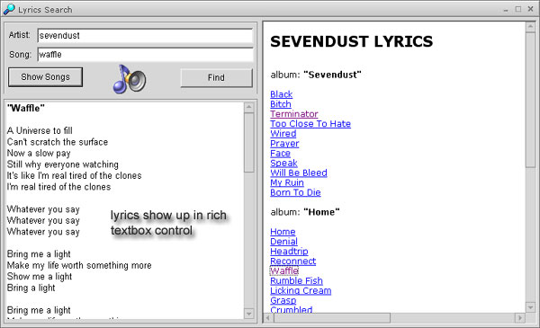



## Find any Lyrics, without the popups\!

### Description

Tired of slow lyrics finding websites with all their popups? I was, until one night I decided to start a little something that turned into a big something. A very useful utility, this can retrive lyrics by artist or or both artist and song name for a quick find. You will see nothing from any lyrics website, this parses the pages from azlyrics.com and puts the lyrics into a rich textbox complete with html parsing (bold, italic, etc). Code is uncommented, yet there are barely any bugs that would bother anyone. If you like, vote - alot of work was put into this. Any improvements are welcome.
 
### More Info
 

             |
---                |---
**Submitted On**   |2002-08-20 12:22:12
**By**             |[James Balducci](https://github.com/Planet-Source-Code/PSCIndex/blob/master/ByAuthor/james-balducci.md)
**Level**          |Intermediate
**User Rating**    |4.9 (34 globes from 7 users)
**Compatibility**  |VB 5\.0, VB 6\.0
**Category**       |[Sound/MP3](https://github.com/Planet-Source-Code/PSCIndex/blob/master/ByCategory/sound-mp3__1-45.md)
**World**          |[Visual Basic](https://github.com/Planet-Source-Code/PSCIndex/blob/master/ByWorld/visual-basic.md)
**Archive File**   |[Find\_any\_L1203148202002\.zip](https://github.com/Planet-Source-Code/james-balducci-find-any-lyrics-without-the-popups__1-38123/archive/master.zip)

